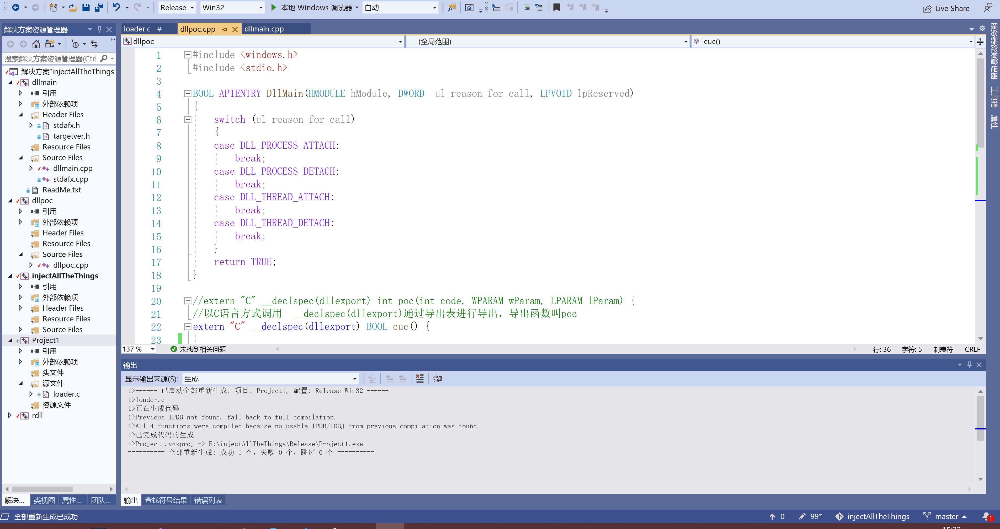

## Dll injection

### **实验要求**

- [x] 参考[样例代码](https://github.com/fdiskyou/injectAllTheThings)，编写一个dll文件，并能在exe中成功调用（第一步不需要实现远程线程注入）
- [x] 通过调用`injectAllTheThings.exe`方法远程注入notepad.exe

### **实验过程**

**1. 编写一个dll文件，并能在exe中成功调用（第一步不需要实现远程线程注入）**


编写`dllpoc.cpp`文件
```cpp
#include <windows.h>
#include <stdio.h>

BOOL APIENTRY DllMain(HMODULE hModule, DWORD  ul_reason_for_call, LPVOID lpReserved)
{
	switch (ul_reason_for_call)
	{
	case DLL_PROCESS_ATTACH:
		break;
	case DLL_PROCESS_DETACH:
		break;
	case DLL_THREAD_ATTACH:
		break;
	case DLL_THREAD_DETACH:
		break;
	}
	return TRUE;
}

//extern "C" __declspec(dllexport) int poc(int code, WPARAM wParam, LPARAM lParam) {
//以C语言方式调用  __declspec(dllexport)通过导出表进行导出，导出函数叫poc
extern "C" __declspec(dllexport) BOOL cuc() {
	

	//为了证明导出表在这
	MessageBox(NULL, L"I am cuc function!", L"2020-11-8!", 0);


	TCHAR szExePath[MAX_PATH];
	TCHAR szInfo[MAX_PATH + 100];
	GetModuleFileName(NULL, szExePath, MAX_PATH);
	wsprintf(szInfo, TEXT("I am in Proccess(%d),Path：%s"), GetCurrentProcessId(), szExePath);
	MessageBox(NULL, szInfo, L"2020-11-8!", 0);

	//假定这里有一个攻击代码 ex 全盘加密

	//return(CallNextHookEx(NULL, code, wParam, lParam));
	return TRUE;
}
//不在导出表
BOOL beijing() {
	MessageBox(NULL, L"POC called!", L"Inject All The Things!", 0);

	//return(CallNextHookEx(NULL, code, wParam, lParam));
	return TRUE;
}
```

新建项目`Project1`，以及源文件`load.c`文件，为了调用dll

```cpp
#include<Windows.h>
#include<stdio.h>
#include<stdlib.h>

typedef BOOL(*CUC_PROC_ADDR)();

int main() {
	HMODULE hmoudle=LoadLibraryA("dllpoc.dll");
	CUC_PROC_ADDR cuc_ptr = (CUC_PROC_ADDR)GetProcAddress(hmoudle, "cuc");
	//获得函数指针,把cuc的地址保存下来
	void* cuc=GetProcAddress(hmoudle,"cuc");
	void* bj = GetProcAddress(hmoudle, "beijing");
	printf("cuc function addr: %p, beijing function addr: %p",cuc,bj);
	cuc_ptr();
}		
```

修改配置类型为`动态库.dll`


#### **实验结果如下**

1.对项目`injectAllTheThings`进行重新生成，运行`Project1.exe`



可以证明，导出函数叫cuc，以C语言方式调用  __declspec(dllexport)通过导出表进行导出，由于`beijing`不是导出函数，故其地址为null

2.查看`Project1.exe`进程的序号和位置，并输出


通过任务管理器验证，此时输出的进程id与位置均正确


**2.通过调用`injectAllTheThings.exe`方法远程注入notepad.exe**


更改dllmain.cpp文件如下

```cpp
// dllmain.cpp : Defines the entry point for the DLL application.
#include "stdafx.h"
//间谍程序
//还应该有几个动态导出库，但不影响dllmain的运行
BOOL APIENTRY DllMain( HMODULE hModule,
                       DWORD  ul_reason_for_call,//ul,dword，无符号长整型
                       LPVOID lpReserved
					 )
{
	switch (ul_reason_for_call)
	{
	case DLL_PROCESS_ATTACH:
		//证明打入敌人内部，在模块内部获取当前使用的模块——表示当前程序所运行的进程
		TCHAR szInfo[MAX_PATH + 100];
		wsprintf(szInfo, TEXT("I am in Proccess(%d)"), GetCurrentProcessId());
		MessageBox(NULL, szInfo, L"2020-11-14!", 0);
		//获得编辑框控件中的文字
		//党notepad进行文件保存或者打开时，实际打开的是另外的文件
		//noetpad是操作系统的一部分，一般都在防御软件的白名单里，恶意软件可以使用这种合法身份
		//或者
		//GetCurrentProcessId();
	
		//MessageBox(NULL, L"Process attach!", L"Inject All The Things!", 0);
		break;
	case DLL_THREAD_ATTACH://dll被线程调用
		//MessageBox(NULL, L"Thread attach!", L"Inject All The Things!", 0);
		break;
	case DLL_THREAD_DETACH:
		//MessageBox(NULL, L"Thread detach!", L"Inject All The Things!", 0);
		break;
	case DLL_PROCESS_DETACH://dll被进程释放
		MessageBox(NULL, L"Process detach!", L"2020-11-14", 0);
		break;
	}
	return TRUE;
}
```

**目标程序是64位，注入的进程也是64位的，对应的，目标程序32位则对应注入进程为32位，否则无法加载成功**

要想注入到记事本（64位），加载一个我们写的恶意dll代码，则需要我们注入的进程也为64位的，故将解决方案配置改成x64进行重新编译和重新生成


打开notepad.exe运行命令（由于该程序进行注入的方式是找到notepad.exe的进程号，故如果被注入进程不打开则无法实现注入


#### **实验结果如下**

 

通过任务栏管理器可以验证notepad的进程号，证明dll也成功注入


### **遇到的问题和解决方法**


### **参考资料**

[fdiskyou/injectAllTheThings](https://github.com/fdiskyou/injectAllTheThings)