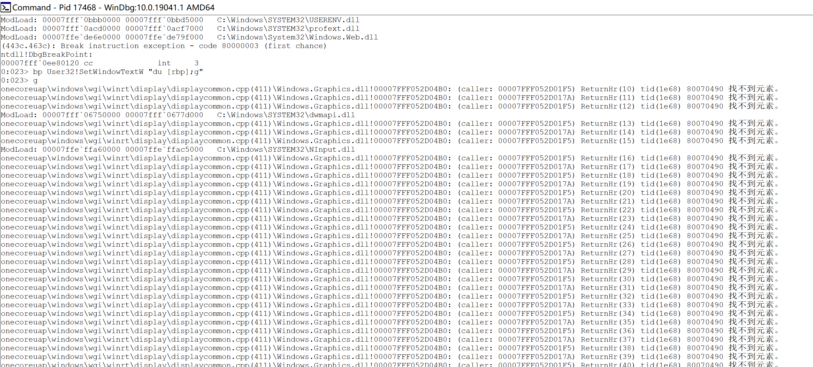

## 利用Windbg实现计算器功能篡改

### **实验要求**

- [x] 利用Windbg对计算器功能进行篡改实现`1+1=3`

### 实验环境

- win7: cn_windows_7_enterprise_x64_dvd_x15-70741.iso
- VirtualBox
- WinDbg:6.12.0002.633 AMD64

### **实验过程**

**1.建立Windbg和calc.exe的连接**

打开计算器，打开Windbg通过`Attach a process`建立连接

**2. 配置Symbol File Path**

在[官方文档](https://docs.microsoft.com/en-us/windows-hardware/drivers/debugger/symbol-path)中将相应的symbol path进行重加载


**3. 配置Symbol File Path**

```
>bp User32!SetWindowTextW "du [rbp];g"
>g
```


```
#执行篡改显示结果的命令
>bp User32!SetWindowTextW ".if(poi(rbp)==32h){eb [rbp] 33h;gc}.else{du [rbp];gc}"
>g
```

#### **实验结果如下**

可以实现对`1+1=3`功能的实现


### **遇到的问题和解决方法**

在Win10中执行以下语句时，

```
>bp User32!SetWindowTextW "du [rbp];g"
>g
```



每在计算器上移动一次时，都是有多条display的显示，且找不到元素

解决：使用virtualbox+win7复刻课上操作

### **参考资料**

[课上实验视频](http://vlab.cuc.edu.cn/student/#/course/89)